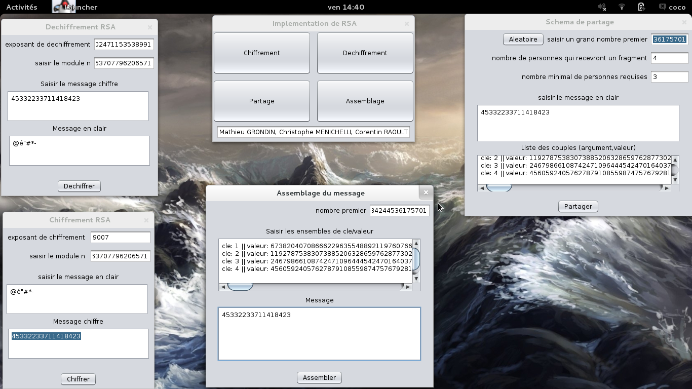

# TP-RSA

Mathieu GRONDIN, Christophe MENICHELLI, Corentin RAOULT

Le but de ce travail est d’implémenter, un algorithme qui permet de chiffrer, déchiffrer, partager et ré-assembler un message en utilisant le cryptosystème RSA. On doit pouvoir choisir l’action à effectuer et à la fin de celle‐ci pouvoir choisir d’en refaire une autre si désiré.  
On s’intéresse, dans ce T.P., qu’au cas d’un petit message (quelques  caractères). 

## Chiffrement:  
* Saisir l’exposant de chiffrement 
* Saisir le module (n)  
* Saisir le message en clair 

## Déchiffrement: 
* Saisir le message chiffré 
* Saisir l’exposant de déchiffrement 
* Saisir le message chiffré

## Partage:  
* Saisir un grand nombre premier (plus grand que le message chiffré) 
* Saisir le nombre de personnes qui recevront une part du message (w) 
* Saisir le nombre minimal de personnes requises pour recouvrer le message (t) 
* Saisir le message à partager 

## Assemblage
* Saisir le minimum de couples clé/valeur
* Saisir le nombre premier n

## Screenshot

N.B.: le code pour les opérations sur les matrices est de Ata Amini et est téléchargeable [ici](http://www.codeproject.com/Articles/405128/Matrix-operations-in-Java)

